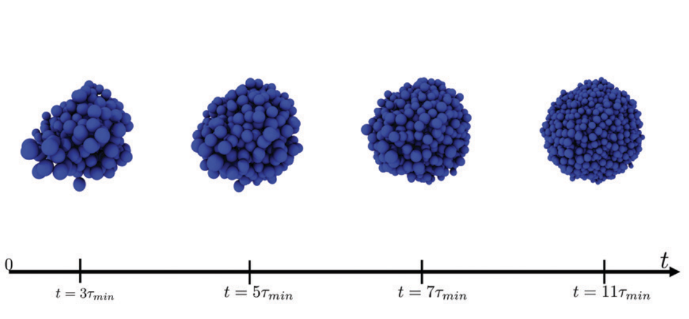

# **Spatially heterogeneous dynamics of cells in a growing tumor spheroid: comparison betweeen theory and experiments**


## 📌 Overview
This repository contains the **MATLAB** code and **data analysis scripts** used in our paper:

> **"Spatially heterogeneous dynamics of cells in a growing tumor spheroid: comparison between theory and experiments"**  
> **Authors:** Sumit Sinha, Abdul N. Malmi-Kakkada, Xin Li, Himadri S. Samanta,and D. Thirumalai  
> **Published in:** *Soft Matter, 2020, 16, 5294-5304*  
> **DOI:** [DOI: 10.1039/C9SM02277E](https://doi.org/10.1039/C9SM02277E)  

This study explores **tumor evolution** using a **3D simulation model** of growing cell colonies, showing how **cell birth-death processes** affect **collective migration, glassy behavior, and superdiffusion. Also, provides one to one comparison with experiments**.

---

## 📂 Repository Structure
```text
/Glass-to-Fluid-Solid-tumors
│── code/         # MATLAB & Python scripts for simulations
│   ├── matlab/   # MATLAB-specific scripts
│── data_analysis_scripts/         # Processed simulation data
│── results/      # Figures, plots, and animations
│── videos/       # Embedded simulation movies
│── README.md     # Project documentation
│── LICENSE       # Licensing information
```


---

## 🚀 Getting Started
### 1️⃣ Clone the Repository
To download the code, use:
```sh
git clone https://github.com/sumit-sinha-seas/spatially_heterogeneous_tumor.git
cd spatially_heterogeneous_tumor
```

### 2️⃣ Running the Simulations
#### **MATLAB**
To run the MATLAB simulation, open MATLAB and execute:
``` matlab
run('code/tumor.m')
```


## 🔬 Key Findings
- The model captures **tumor invasion** by simulating **cell growth, adhesion, and migration**.
- Model shows spatially heterogeneous dynamics of cells in a growing spheroid.
**Cells at the periphery** move faster, **undergoing superdiffusive dynamics**, while **interior cells undergo sub-diffusive dynamics**.
- Shows **one to one comparsion with experiments**.

## 🎥 Simulation Videos
🔹 Click below to watch each simulation:

- [▶️ Watch Video 1](https://drive.google.com/file/d/1cDcTIq8nfolsKBTewVua1kj49Q_gUthZ/view?usp=sharing)
- [▶️ Watch Video 2](https://drive.google.com/file/d/1gEM12Pp7qkOX0vMOkjsdiYf-Xlr2jPQZ/view?usp=sharing)
- [▶️ Watch Video 3](https://drive.google.com/file/d/1VnwTGeGLc0rPAIivUYFVcQqMaR71drEa/view?usp=sharing)


## 📜 Citation
If you use this code in your research, please cite our paper:
```bibtex
@article{sinha2020spatially,
  title={Spatially heterogeneous dynamics of cells in a growing tumor spheroid: Comparison between theory and experiments},
  author={Sinha, Sumit and Malmi-Kakkada, Abdul N and Li, Xin and Samanta, Himadri S and Thirumalai, D},
  journal={Soft matter},
  volume={16},
  number={22},
  pages={5294--5304},
  year={2020},
  publisher={Royal Society of Chemistry}
}
```